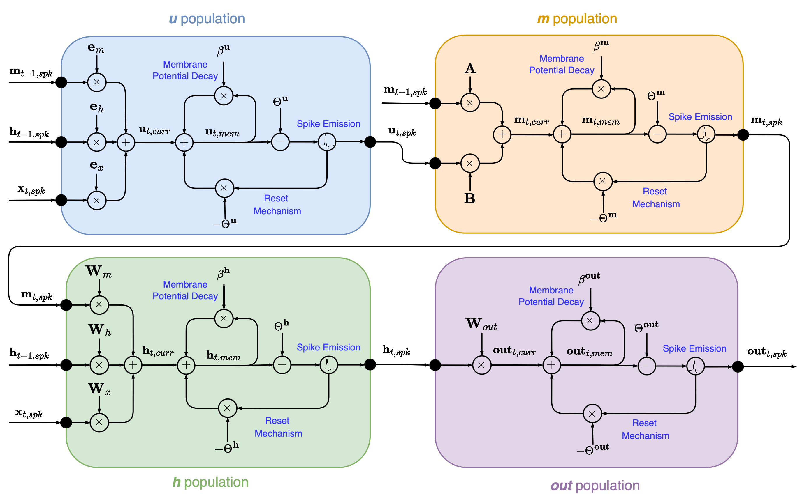

# LIF-based Legendre Memory Unit (L²MU)

Official implementation of the paper:  
**_“A LIF-based Legendre Memory Unit as Neuromorphic State Space Model benchmarked on a second-long spatio-temporal task”_**  
by *Benedetto Leto, Gianvito Urgese, Enrico Macii, and Vittorio Fra* — Politecnico di Torino

---

## Abstract

This repository hosts the implementation and experiments from the paper *"A LIF-based Legendre Memory Unit as Neuromorphic State Space Model benchmarked on a second-long spatio-temporal task"*.  
The **L²MU** is a fully spiking reinterpretation of the **Legendre Memory Unit (LMU)**, where each core block—encoder, hidden state, and memory—is replaced by a **population of Leaky Integrate-and-Fire (LIF) neurons**.  
All communications between these populations occur via **synaptic currents and spike trains**, leading to a neuromorphic **state-space model** capable of long-range temporal processing and energy-efficient computation.

Benchmarking on the **event-based Braille letter recognition task** shows that the L²MU **outperforms recurrent SNNs**, achieving **85.6%** accuracy on the complete 27-class dataset and **97.1%** on a 7-class subset.

---

## Architecture Overview

The L²MU redesigns the original LMU’s mathematical formulation into a spike-driven system.

<p align="center">
  
</p>

| LMU Component | L²MU Equivalent | Communication Type |
|----------------|------------------|--------------------|
| Encoder        | LIF population `u` | Spike-based synaptic currents |
| Memory         | LIF population `m` | Spike-based temporal integration |
| Hidden state   | LIF population `h` | Recurrent spike-driven computation |

Each block emits spikes according to its membrane potential \( $U_t$ \) governed by:
\[
$U_t = \beta U_{t-1} + W X_t - S_{t-1} \Theta$
\]
and spikes when \( $U_t > \Theta$ \).

---

## Methodology

### 1. Model Design

- All LMU components are modeled as **LIF neuron populations**.  
- The Leaky neuron model from **snnTorch** is used to describe the temporal integration and threshold dynamics.  
- Parameters \( $\beta$ \), \( $\Theta$ \), connection weights \( $W$ \), and encoding vectors \( $e$ \) are learned during training.  
- State-space matrices \( $A$ \) and \( $B$ \) are kept from their Padé approximants.

### 2. Dataset

- **Event-based Braille dataset** ([Müller-Cleve et al., Frontiers in Neuroscience, 2022](https://www.frontiersin.org/articles/10.3389/fnins.2022.951164/full))  
- Derived from 12 capacitive tactile sensors sliding over Braille letters.  
- Sampling frequency: **40 Hz**  
- Two setups:
  - **Full set:** 27 classes (‘A’–‘Z’, ‘Space’)  
  - **Subset:** 7 classes (‘Space’, ‘A’, ‘E’, ‘I’, ‘O’, ‘U’, ‘Y’)  
- Spike encoding performed via **sigma-delta modulation** (ϑ = 1, Δt = 5 ms).

### 3. Training and Optimization

- Framework: **PyTorch + snnTorch**
- Optimizer: **Adam**
- Hyperparameter optimization via **Microsoft NNI**  
- **1000 training trials**, 300 epochs, early stopping with *Medianstop* assessor  
- Objective: maximize validation accuracy  
- 10 random training-validation splits used to mitigate overfitting

---

## Optimal Hyperparameters

| Hyperparameter | Full Dataset | 7-Class Subset |
|----------------|---------------|----------------|
| Learning rate | 0.0004 | 0.00145 |
| Batch size | 64 | 64 |
| Order (d) | 4 | 7 |
| θ | 7 | 10 |
| h population size | 160 | 120 |
| m population size | 250 | 70 |
| βᵤ | 0.65 | 0.8 |
| Θᵤ | 0.1 | 0.2 |
| βₕ | 0.15 | 0.45 |
| Θₕ | 0.75 | 0.65 |
| βₘ | 0.35 | 0.2 |
| Θₘ | 0.4 | 0.4 |
| βₒ | 0.15 | 0.6 |
| Θₒ | 0.1 | 0.15 |

---

## Results

| Dataset | Accuracy (%) | Previous SNN (%) | Improvement |
|----------|---------------|------------------|--------------|
| Braille (27 classes) | **85.55** | 81.8 | +3.75 |
| Braille (7 classes) | **97.14** | 95.0 | +2.14 |

---

## NeuroBench Characterization

| Metric | Full Dataset | 7-Class Subset |
|---------|---------------|----------------|
| Parameters | 4.9×10⁵ | 1.19×10⁵ |
| Activation sparsity | 0.97 | 0.96 |
| Connection sparsity | 0.13 | 0.21 |
| Membrane updates | 2.39×10⁵ | 1.23×10⁵ |
| Effective MACs | 0 | 0 |
| Effective ACs | 2.04×10⁶ | 0.90×10⁶ |
| Dense operations | 1.27×10⁸ | 3.15×10⁷ |
| Footprint | 1.96 MB | =.48 MB |

---

## Installation

Python version = 3.11.10

```bash
git clone git@github.com:neuromorphic-polito/nice_2025.git
pip install -r requirements.txt
```

Dependencies:
- torch
- snntorch
- numpy
- matplotlib
- nni
- neurobench

---

## Usage

### Hyper Parameter Optimization 

```bash
cd nni_suite
python nni_main.py
```

### Evaluation and Benchmark

```bash
cd nni_suite
python test.py
```

---

## Repository Structure

```
├── architecture/           # L²MU model implementations and core components
├── data/                   # Dataset loaders and preprocessed data splits
├── nni_suite/              # Training, optimization, and evaluation scripts
├── model_insights/         # Experimental results, best parameters, and analysis
├── searchspace/            # Hyperparameter search space configurations
├── prepare_splits.py       # Dataset preparation utility
└── requirements.txt        # Python dependencies
```

---

## Citation

If you use this work, please cite:

```bibtex
@inproceedings{leto2025l2mu,
  title={A LIF-based Legendre Memory Unit as Neuromorphic State Space Model benchmarked on a second-long spatio-temporal task},
  author={Leto, Benedetto and Urgese, Gianvito and Macii, Enrico and Fra, Vittorio},
  year={2025},
  booktitle={NICE 2025}
}
```

---

## Authors

**Benedetto Leto** (benedetto.leto@polito.it), **Gianvito Urgese** (gianvito.urgese@polito.it), **Enrico Macii** (enrico.macii@polito.it), **Vittorio Fra** (vittorio.fra@polito.it)  
Politecnico di Torino, Italy